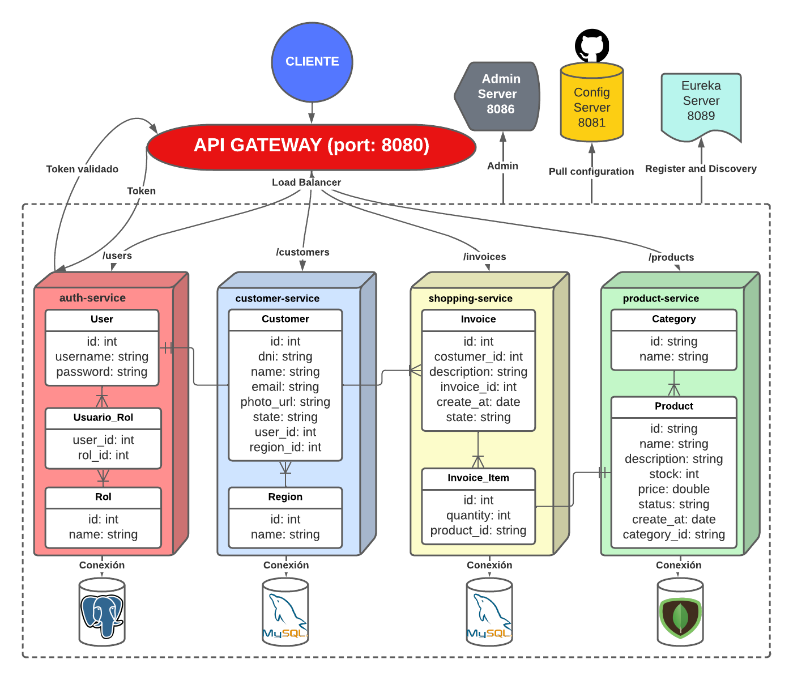

# MICROSERVICIO - SPRING CLOUD BY COMIDEV
## BIENVENIDO

El presente proyecto es una práctica de Microservicios con Spring Cloud y Spring Boot.
Está descompuesto por subdominios. La infraestructura está centralizada con Spring Cloud Cofig, que recupera las configuraciones de Github.
El registro y descubrimiento está realizado con Spring Cloud Eureka ya que se integra muy bien con muchos proyectos de Spring Cloud.
La comunicación está realizada con OpenFeign.
La integración de los microservicios se hizo con Spring Cloud Gateway o una API Gateway, que corre en el puerto "8080" del localhost.
La observabilidad, seguimiento y monitoreo está hecha con Spring Cloud Admin.

Test:
- Tests de Integración con MockMVC
- Test Unitarios con Mockito y JUnit5

Puertos
-   API Gateway: 8080
-   Eureka: 8089
-   Config Server: 8081
-   Admin Server: 8086

## SERVICIOS

### 1. AUTH-SERVICE

Maneja las entidades Usuario y Rol, sirve para autenticar y autorizar.

### 2. CUSTOMER-SERVICE

Maneja las entidades Customer y Region, sirve para gestionar a los clientes.

### 3. SHOPPING-SERVICE

Maneja las entidades Invoice y InvoiceItem, sirve para gestionar a las compras.

### 4. PRODUCT-SERVICE

Maneja las entidades Product y Category, sirve para gestionar a los productos.
